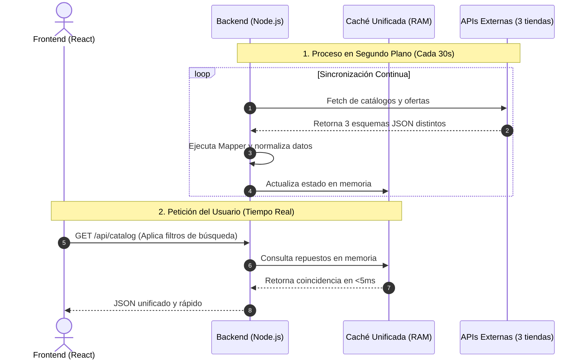

# Catálogo TurboShop - Solución Fullstack

Solución para la prueba técnica de TurboShop. Integra un backend en Node.js con normalización de datos y caché en memoria, junto a un frontend en React optimizado para renderizado rápido y sincronización en tiempo real.

---

## 1. Instalación y Ejecución

**Requisitos:** Node.js (v16+) y `npm`.

**1. Variables de Entorno (.env):**
Por seguridad, crea los archivos localmente:
* En `/backend/.env`:
    ```env
    PORT=
    BACKEND_URL=
    ```
* En `/frontend/.env`:
    ```env
    VITE_BACKEND_URL=
    ```

**2. Instalación y levantamiento (Script Maestro):**
```bash
npm install && cd backend && npm install && cd ../frontend && npm install && cd ..
npm start
```

## 2: Documentación de Endpoints y Decisiones de Arquitectura

### 2.1. Endpoints de la API

La API RESTful está diseñada para servir datos normalizados al frontend de manera eficiente, abstrayendo la complejidad de los proveedores externos.

**A. Obtener Catálogo Paginado y Filtrado**

* **Ruta:** `GET /api/catalog`
* **Descripción:** Devuelve la lista de repuestos consolidada, aplicando filtros de búsqueda en la caché de memoria del servidor.

| Parámetro (Query) | Tipo | Descripción | 
| :--- | :--- | :--- | 
| `page` | `Number` | Número de página actual (Por defecto: 1). | 
| `limit` | `Number` | Cantidad de productos por página (Por defecto: 20). | 
| `search` | `String` | Búsqueda global (SKU, nombre, marca o vehículos compatibles). | 
| `brand` | `String` | Filtro exacto por la marca del repuesto. | 
| `carMake` | `String` | Filtro parcial por el fabricante del vehículo compatible. | 
| `model` | `String` | Filtro parcial por el modelo del vehículo. | 
| `year` | `String` | Filtro predictivo por año (Ej: "200" abarca 2000-2009). | 

**B. Obtener Detalles de un Repuesto (Consolidado)**

* **Ruta:** `GET /api/catalog/:sku`
* **Descripción:** Devuelve la información detallada de un producto específico, unificando las ofertas por proveedor y la lista de compatibilidad.

| Parámetro (Path) | Tipo | Descripción | 
| :--- | :--- | :--- | 
| `sku` | `String` | Código único de identificación del repuesto a consultar. | 

* **Ejemplo de Respuesta Exitosa (`200 OK`):**

```json
{
  "sku": "CL-MOC6KMXM",
  "name": "Compresor de Aire",
  "brand": "BOSCH",
  "image": "[https://ejemplo.com/img.jpg](https://ejemplo.com/img.jpg)",
  "totalStock": 7,
  "offers": [
    {
      "provider": "RepuestosMax",
      "warehouse": "Bodega Central",
      "stock": 5,
      "price": 125000
    },
    {
      "provider": "AutoPartsPlus",
      "warehouse": "Sucursal Norte",
      "stock": 2,
      "price": 128000
    }
  ],
  "compatibleVehicles": [
    {
      "make": "Lexus",
      "model": "LS500",
      "yearStart": 2008,
      "yearEnd": 2013
    },
    {
      "make": "Volkswagen",
      "model": "Jetta",
      "yearStart": 2014,
      "yearEnd": 2022
    }
  ]
}

```

### 2.2. Decisiones de Arquitectura y Diseño (Trade-offs)

Durante el desarrollo se tomaron decisiones estrictas enfocadas en el rendimiento, la escalabilidad y una experiencia de usuario (UX) fluida y robusta.

**Backend:**

* **Arquitectura Sin Base de Datos:** Al recibir la información directamente desde las APIs de los proveedores, se decidió no utilizar una base de datos propia. Esto evita la duplicación innecesaria de información y optimiza el uso de espacio.
* **Sincronización en Segundo Plano y Caché en Memoria:** Debido al requisito de aplicar filtros globales sin base de datos, y a la necesidad de actualizar el stock sin recargar la página, el servidor Node.js ejecuta un proceso de sincronización cada 30 segundos, manteniendo un catálogo unificado en la memoria RAM. Esto asegura tiempos de respuesta menores a 5ms, previene bloqueos por *Rate Limiting* y permite buscar un artículo de la página 5 estando en la página 1.
* **Patrón Mapper Estricto para Normalización:** Al tener datos organizados de tres maneras distintas y previendo la integración de más proveedores a futuro, se implementó un *mapper* para cargar los datos en un único "Contrato de Datos" predecible. Esto desacopla completamente el frontend del caos de las APIs externas.

**Frontend:**

* **Vista Rápida (Modal) vs. Navegación por Rutas:** Para el detalle del producto, se optó por un modal flotante. Ya que la cantidad de metadata no era tan alta como para requerir una página entera, esto mantiene al usuario en el flujo de búsqueda en lugar de complicarlo con múltiples ventanas. Permite revisar múltiples repuestos cómodamente sin perderse entre páginas ni resetear los filtros.
* **Optimización de Rendimiento Visual:** Se priorizó la fluidez eliminando efectos visuales pesados (como animaciones excesivas o filtros de desenfoque/blur). Esto evita caídas de rendimiento o "lag" al interactuar con la página, garantizando una mayor comodidad para el usuario.
* **Trato de errores de conección con API externa:** Ocasionalmente las llamadas a APIs externas arrojan error, provocando que no se reciban datos o bien se cambien sus valores de atributos a estándar. Se decidió que cuando ocurra esto los datos de tal proveedor no cambien hasta que exista una nueva request con datos nuevos, para mantener estabilidad en los datos y no ver una gran oscilación de ellos.
* **Panel de Filtros Desplegable:** Para que el usuario pueda centrarse en visualizar los repuestos sin una interfaz saturada, las herramientas de búsqueda avanzada se colocaron en un panel lateral desplegable, manteniéndose ocultas pero accesibles mediante un botón bien visible cuando se necesitan.
* **Filtrado Reactivo en Tiempo Real:** Los filtros por nombre, año, etc., se aplican a medida que el usuario escribe. Esto ofrece retroalimentación inmediata si hay un error de tipeo o si la búsqueda no arroja resultados, otorgando mayor comodidad al no requerir un botón de confirmación extra.
* **Sincronización en Tiempo Real con React Query:** Se delegó la gestión de estado asíncrono a `@tanstack/react-query`. Implementando un `refetchInterval` invisible de 30 segundos tanto en el catálogo como en la vista de detalles, la interfaz refleja cambios de stock y precio en tiempo real sin recargar la página.
* **Gestión de Errores Visuales (Image Fallbacks):** Para manejar la inconsistencia o caída de los enlaces a imágenes de las APIs externas, se implementó una captura mediante `onError` en React. Esta solución genera dinámicamente imágenes de reemplazo (*placeholders*) legibles usando el nombre del producto, evitando que la interfaz se vea rota.
* **Búsqueda Predictiva de Fechas:** Se mejoró el algoritmo de filtrado de años en el backend para funcionar por coincidencias de prefijo.

## 3: Diagrama de Flujo


